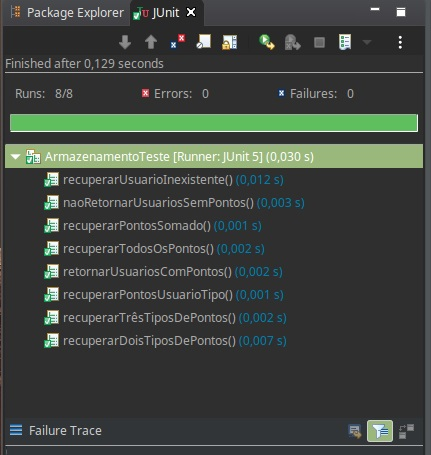
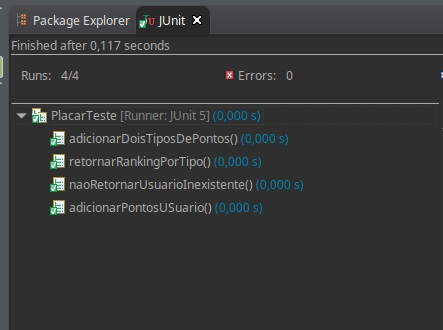
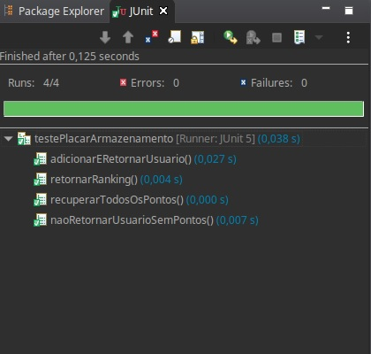

Nesta tarefa será utilizado o TDD para desenvolver um componente de gamificação. Esse componente deve armazenar diferentes tipos de pontos que o usuário pode receber. Por exemplo, uma aplicação pode possuir pontos do tipo "moeda" e "estrela", enquanto outra pode possuir pontos do tipo "topico", "comentario" e "curtida". Esse componente deve possuir uma classe principal chamada Placar, onde deve ficar a lógica, e uma classe chamada Armazenamento, que deve ser responsável por guardar e recuperar as informações de um arquivo.

A classe Armazenamento deve ser capaz de realizar as seguintes operações:

* Armazenar que um usuário recebeu uma quantidade de um tipo de ponto. Por exemplo: o usuário "guerra" recebeu "10" pontos do tipo "estrela"
* Recuperar quantos pontos de um tipo tem um usuário. Por exemplo: retornar quantos pontos do tipo "estrela" tem o usuário "guerra"
* Retornar todos os usuários que já receberam algum tipo de ponto.
* Retornar todos os tipos de ponto que já foram registrados para algum usuário.

Observação: os dados devem ser armazenados em um arquivo e como serão armazenados fica a critério do aprendiz. A seção "Formas de implementar o armazenamento em arquivo" dá algumas sugestões.

A classe Placar é composta por uma instância de Armazenamento, a quem delega a recuperação e o armazenamento das informações. A classe Placar deve ter métodos que executam as seguintes operações:

* Registrar um tipo de ponto para um usuário. Por exemplo: o usuário "guerra" recebeu "10" pontos do tipo "estrela"
* Retornar todos os pontos de um usuário. Por exemplo: ao pedir os pontos do usuário "guerra" ele me retornaria que possui "20" pontos do tipo "moeda" e "25" pontos do tipo "estrela". Um tipo de ponto que o usuário não possuir, não deve ser retornado com valor "0". Por exemplo: se o usuário "guerra" não possui pontos do tipo "energia", esses não devem ser incluídos na resposta.
* Retornar ranking de um tipo de ponto, com a lista de usuário que possuem aquele ponto ordenados do que possui mais para o que possui menos. Por exemplo: ao pedir o ranking de "estrela", seria retornado "guerra" com "25", "fernandes" com "19" e "rodrigo" com "17". Um usuário que não possui pontos daquele tipo não seria incluído no ranking. Por exemplo, o usuário "toco" sem pontos do tipo "estrela" não seria incluído. 

Os testes da classe Armazenamento devem ser feitos utilizando arquivos e os testes da classe Placar devem ser feitos criando um mock object para a instância de Armazenamento. Por fim, devem ser criados alguns testes de integração incluindo as duas classes.

A criação de outras classes e a assinatura dos métodos fica a critério do aprendiz, desde que cumpra os requisitos solicitados. Com a exceção de construtores e métodos de acesso, nenhum outro método público pode ser adicionado nas classes Armazenamento e Placar.

Não esqueça de utilizar o TDD para o desenvolvimento e de refatorar sempre o código para manter a sua qualidade!
## Review criteria

Você será avaliado com base no seguinte:

* Cumprimento dos requisitos de implementação pedidos no enunciado
* Organização do código implementado
* Uso correto de Mock Objects
* Divisão correta de responsabilidades entre as classes

## Formas de implementar o armazenamento em arquivo

É deixado livre a forma como os dados de pontuação do usuário serão armazenado em um arquivo, desde que os requisitos sejam cumpridos. É importante que outras classes não dependam de forma alguma de como é feita essa armazenagem no arquivo.

Uma abordagem para armazenar os dados seria fazer isso de uma forma incremental. Sempre só adicionando dados no arquivo. Nesse caso, para saber a pontuação de um usuário, seria necessário percorrer todo o arquivo procurando por todos os dados a respeito dele.

Outra abordagem seria ter um registro para cada usuário dentro do arquivo e modificar esse registro à medida que novos dados forem chegando.

Independente da abordagem de armazenar no arquivo, você pode também guardar um cache dos dados em memória. O único requisito nesse caso é que se a aplicação cair, deve-se recuperar todos os dados armazenados.

A pesquisa faz parte da rotina de qualquer profissional de computação, sendo assim, é considerado parte desse exercício a pesquisa das classes que podem ser utilizadas para a interação com arquivos. Lembre-se de ir seguindo o TDD e fazendo a implementação passo a passo. Você verá que assim é bem mais fácil de utilizar uma classe que você ainda não conhece. 

# Classe Armazenamento  

## Métodos Públicos

### Armazenar uma quantidade de um tipo de ponto em um usuário

~~~java

void  armazenarPontos(int qtdPontos, string tipoPonto, string usuario);

~~~

  

* Criar arquivo

~~~java

ct1:[(int  "5", string "moeda", string "Mario") ->  true  ->  true

~~~

  

### Recuperar pontos de um tipo de um usuário

  

~~~java

int  recuperarPontosUsuarioTipo(String usuario, String tipoPonto);

~~~

  

* Recuperar pontos adicionado uma vez

~~~java

ct1:[(string "mario", string "moeda") ->  "mario moeda: 5"  ->
 recuperarPontosUsuarioTipo("mario", "moeda")]

~~~

  

* Recuperar pontos somados

~~~java

ct2:[(String "luigi", string "moeda") ->  "luigi moeda: 10"  ->
 recuperarPontosUsuarioTipo("luigi", "moeda")]~

~~~

  

* Recuperar dois tipos de pontos

~~~java

ct3:[(String "luigi", string "moeda") ->  "luigi moeda: 10"  ->
 recuperarPontosUsuarioTipo("luigi", "moeda")]

  

[(String "luigi", string "estrela") ->  "luigi estrela: 1"  ->
 recuperarPontosUsuarioTipo("luigi", "estrela")]

~~~

  

* Recuperar três tipos de pontos

~~~java

ct4:[(String "luigi", string "moeda") ->  "luigi moeda: 10"  ->
 recuperarPontosUsuarioTipo("luigi", "moeda")]

  

[(String "luigi", string "estrela") ->  "luigi estrela: 1"  -> 
recuperarPontosUsuarioTipo("luigi", "estrela")]

  

[(String "luigi", string "cogumelo") ->  "luigi cogumelo: 5"  -> 
recuperarPontosUsuarioTipo("luigi", "cogumelo")]

~~~

  

* Recuperar pontos de usuário inexistente

~~~js

ct5:[(string  "wario", string  "moeda") -> UsuarioInexistenteException -> usuarioInexistenteException

~~~

  

### Retornar todos os usuários que já receberam algum tipo de ponto

~~~java

List<String> retornarTodosOsUsuariosComPontos();

~~~

  

* Não retornar usuários sem pontos

~~~js

ct1:[() -> false -> retornarTodosOsUsuariosComPontos().contains("Waluigi")]

[() -> false -> retornarTodosOsUsuariosComPontos().contains("Birdo")]

~~~

  

* Recuperar usuario com ponto

~~~js

ct2:[() -> true -> retornarTodosOsUsuariosComPontos().contains("Mario")]

[() -> true -> retornarTodosOsUsuariosComPontos().contains("Luigi")]

~~~

  

### Retornar todos os tipos de ponto de algum usuário@@@@@@@@@@@@@@@@@

* Retornar todos os tipos de pontos de um usuário

~~~java

String retornarTodosOsPontos(String usuario)

~~~

  

Retornar todos os pontos de um usuário com varios tipos de pontos

~~~javascript

ct1:[String  "Luigi" -> "Luigi moeda 10, estrela 1, cogumelo 5" ->
retornarTodosOsPontos("Luigi")]

~~~

  

## Funções

*  [x] Criar arquivo

*  [x] Armazenar diferentes tipos de pontos em um usuário

*  [x] Guardar dados em arquivo

*  [x] Deve ser criado de modo que a classe não dependa de como é feita essa armazenagem

*  [x] Realizar testes utilizando arquivos

  

# Classe Placar

## Métodos Públicos

### Registrar um tipo de ponto para um usuário

~~~java

Boolean  adicionarPontosUsuario(String usuario, String tipoPonto, int qtdPontos);

~~~

  

* Adicionar 5 moedas para o mario no mock

~~~js

ct1:[(String  "Mario", String  "moeda", int  5 -> true ->
adicionarPontosUsuario("Mario", "moeda", 5)]

~~~

  

### Retornar todos os pontos de um usuário, assim como os tipos. Ex: Estrela 20, moeda 25

  
  

~~~java

String  retornarTodosOsPontosUsuario(String usuario);

~~~

  

* Retornar todos os pontos de um usuario

~~~javascript

ct1:[String  "Mario" -> "Mario moeda 5" -> retornarTodosOsPontosUsuario("Luigi")]

~~~

  
  

* Erro usuário inexistente

~~~javascript

ct2:[String  "Waluigi" -> UsuarioInexistenteException -> 
retornarTodosOsPontosUsuario("Waluigi")]

~~~

  

### Retornar  ranking  de  um  tipo  de  ponto, com  a  lista  de  usuários  que  possuem  aquele  ponto  ordenados  em  ordem  decrescente

  

* Retornar  ranking  ordenado

~~~java

String  retornarRankingTipo(String  tipoPonto);

~~~

  

~~~javascript

ct1:[() -> "Luigi 10\n Mario 5" -> retornarRankingTipo("Moeda")]

~~~

  

## Funções

*  [x] Utiliza uma instância de Armazenamento

*  [x] Realizar testes com um mock object substituindo Armazenamento

*  [x] Delega a recuperação e o armazenamento de informações para a classe Armazenamento.

  

# Integração

*  [x] Criar alguns testes de integração com as duas classes

  

* Recuperar todos os pontos de um usuario

~~~javascript

ct1:[String  "Luigi" -> "Luigi moeda 10, estrela 1, cogumelo 5" -> retornarTodosOsPontosDeUmUsuario("Luigi")]

~~~

  

* Retornar ranking por tipo

~~~java

placar.adicionarPontosUsuario("Yoshi", "moeda", 15);

assertEquals("Yoshi moeda 15", placar.retornarTodosOsPontosDeUmUsuario("Yoshi"));

~~~

  

* Adicionar um usuário "Yoshi" e retorna-lo

~~~java

assertEquals(null, placar.retornarTodosOsPontosDeUmUsuario("Zaquin"));

~~~

# Resultado dos testes

